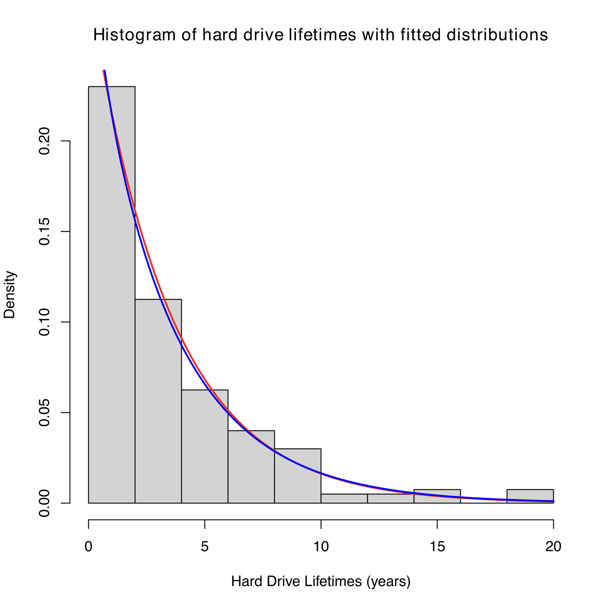
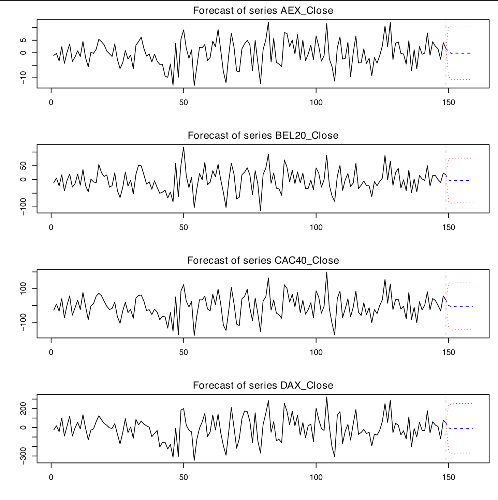
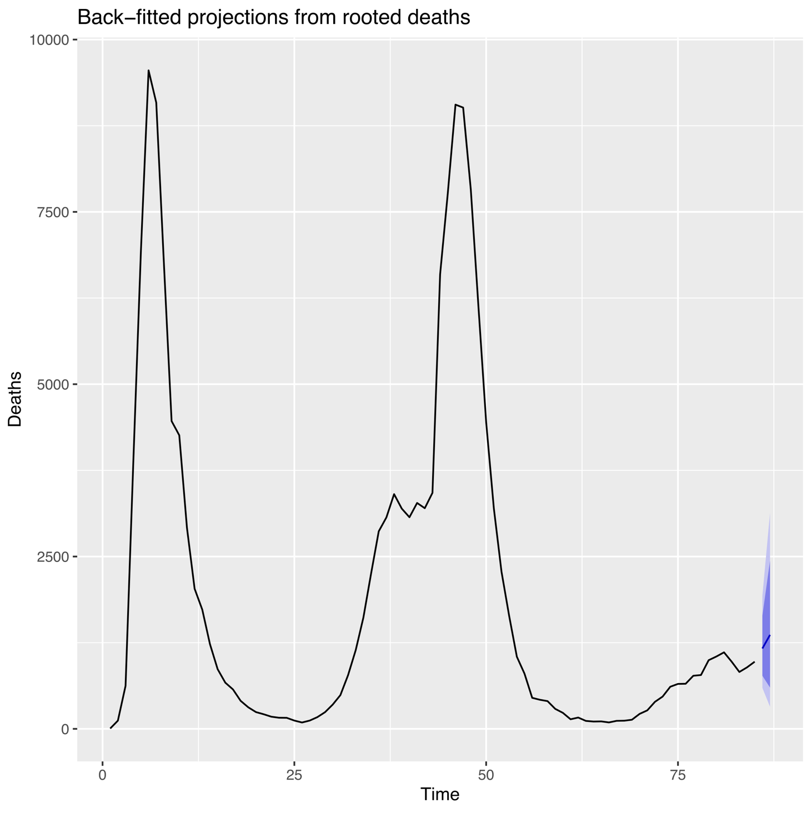

#+title: Time Series Modelling
#+author: R

* Project Specifications

This is a project exploring a wide variety of datasets, from financial to industry production, and evaluating them using standard time series methods. All datasets have been included in data/, and the code is linked and explained in [[file:src/Main.rmd][a markdown file]]. A full [[file:Project.pdf][report]] has been compiled as well.

* Pearson Family Fitting (Battery Lifespans)

The first section predicts the likelihood of a battery failing within a certain period using the Pearson family of distributions. After examining the Kolmogorov-Smirnov test, AIC, and BIC values, it was concluded that the exponential distribution was the most accurate, but plots are made for both.

* ARIMA and VAR (Stock Close Prices)

ARIMA is applied to stock close price datasets in order to estimate near future stock prices. After concluding that serial correlation was too much of a problem for estimating the individual stocks, the choice was made to fit an Engle-Granger model instead, with greater explanatory power for a set of cointegrated stocks and more datapoints to use to avoid serial correlation. Predictions were then generated and visualised for the portfolio, and no evidence of serial correlation or inappropriate residuals was discovered in post regression testing.

* ARIMA (COVID Mortality)

ARIMA and log ARIMA models were fitted and compared with an extreme focus on model fit and testing. Keen attention paid to evidence of continued non-stationarity through ACF plots and augmented Dickey-Fuller testing. Projections were generated and compared for near future mortality due to COVID.

* GARCH Modelling (Stock Returns)

Conversion of stock prices to stock returns was followed for ARCH testing. After non-random volatility was detected and an aDF test confirmed non-unit variance, a GARCH model was fitted. Post regression testing examined a suite of tests to ensure parameter selection was appropriate, and model alpha and beta carefully evaluated and explained in simple terms.

#+begin_example
Title:
 GARCH Modelling 

Call:
 garchFit(formula = USD.GBP.Close ~ arma(1, 2) + garch(1, 1), 
    data = pre_crash, trace = FALSE) 

Mean and Variance Equation:
 USD.GBP.Close ~ arma(1, 2) + garch(1, 1)
 [data = pre_crash]

Conditional Distribution:
 norm 

Coefficient(s):
         mu          ar1          ma1          ma2        omega       alpha1        beta1  
 3.5594e-04  -9.9023e-01   9.9098e-01   7.8292e-03   2.5224e-07   4.6400e-02   9.4962e-01  

Std. Errors:
 based on Hessian 

Error Analysis:
         Estimate  Std. Error  t value Pr(>|t|)    
mu      3.559e-04   2.318e-04    1.535   0.1247    
ar1    -9.902e-01   1.007e-02  -98.307  < 2e-16 ***
ma1     9.910e-01   2.773e-02   35.734  < 2e-16 ***
ma2     7.829e-03   2.543e-02    0.308   0.7582    
omega   2.522e-07   1.167e-07    2.161   0.0307 *  
alpha1  4.640e-02   6.961e-03    6.666 2.63e-11 ***
beta1   9.496e-01   6.850e-03  138.632  < 2e-16 ***
---
Signif. codes:  0 ‘***’ 0.001 ‘**’ 0.01 ‘*’ 0.05 ‘.’ 0.1 ‘ ’ 1

Log Likelihood:
 7190.182    normalized:  3.802317 

Description:
 Wed Dec 17 04:34:09 2025 by user:  

Standardised Residuals Tests:
                                   Statistic   p-Value
 Jarque-Bera Test   R    Chi^2  4.695102e+04 0.0000000
 Shapiro-Wilk Test  R    W      9.291171e-01 0.0000000
 Ljung-Box Test     R    Q(10)  3.098746e+00 0.9790037
 Ljung-Box Test     R    Q(15)  7.088517e+00 0.9551467
 Ljung-Box Test     R    Q(20)  1.292927e+01 0.8803982
 Ljung-Box Test     R^2  Q(10)  1.063699e+01 0.3864895
 Ljung-Box Test     R^2  Q(15)  1.090979e+01 0.7589627
 Ljung-Box Test     R^2  Q(20)  1.184517e+01 0.9213021
 LM Arch Test       R    TR^2   1.067555e+01 0.5569095

Information Criterion Statistics:
      AIC       BIC       SIC      HQIC 
-7.597231 -7.576705 -7.597258 -7.589673 

#+end_example

